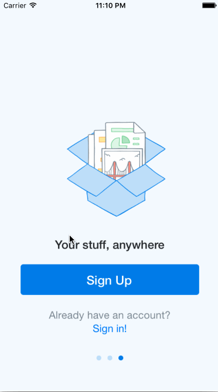

# Dropbox

This is a DropBox Prototype application for iOS submitted as the [project 1](http://courses.codepath.com/courses/ios_for_designers/unit/1#!assignment) for CodePath: iOS for Designers.

Time spent: 4 hr

Completed:

* [x] Required: Users can tap through the 3 welcome screens.
* [x] Required: User can follow the create user flow.
* [x] Required: User can follow the sign in flow.
* [ ] Optional: Add a detail view for one of the files and implement favoriting the file.
* [ ] Optional: Add UITextFields for the forms so you can actually type in them and handle dismissing the keyboard.
* [x] Optional: You should be able to swipe through the welcome screens instead of just tapping them.

